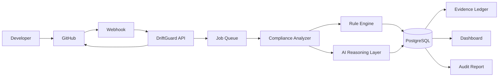

# BUILD DRIFTGUARD AI — PRODUCTION-READY AI COMPLIANCE ENGINEERING PLATFORM

## 0. ROLE

You are a senior staff-level full-stack engineer, AI engineer, DevOps engineer, security engineer, product designer, and technical architect.

Your task is to design, implement, test, debug, document, and deploy a complete production-quality application called:

# DriftGuard AI

### Tagline

**Catch compliance drift before it ships.**

### One-line description

DriftGuard AI is an AI-powered compliance engineering platform that continuously analyzes software changes, identifies high-risk security and compliance issues before deployment, explains the relevant control or regulation, recommends concrete fixes, and automatically maintains an audit-ready evidence ledger.

---

# 1. IMPORTANT EXECUTION RULES

Do NOT create a mockup.

Do NOT create a static frontend.

Do NOT create fake API responses.

Do NOT create placeholder buttons that do nothing.

Do NOT implement only the UI.

Do NOT stop after generating the architecture.

Do NOT leave core functionality as TODO comments.

The final application must be:

- fully functional
- responsive
- polished
- secure
- testable
- deployable
- documented
- demo-ready
- submission-ready

Every major button must perform a real action.

Every dashboard metric must come from real persisted data.

Every AI result must be generated through the configured AI provider or a deterministic fallback when explicitly necessary for local development.

Every GitHub integration must use real GitHub APIs.

Every compliance finding must be persisted.

Every remediation action must update the database.

Every PR review must be traceable.

Every audit evidence record must have provenance.

---

# 2. THE CORE PROBLEM

Software teams often discover compliance and security problems AFTER code has already shipped.

Examples:

- personally identifiable information is written to logs
- secrets are accidentally committed
- insecure CORS configuration is introduced
- authentication controls are weakened
- encryption is missing
- rate limiting disappears
- sensitive data is sent to third-party services
- security controls are removed during refactoring
- compliance evidence is scattered across GitHub, cloud dashboards, tickets, and documents

Traditional compliance tools often focus on periodic audits.

DriftGuard moves compliance into the development workflow.

Instead of:

CODE → DEPLOY → AUDIT → DISCOVER PROBLEM

DriftGuard creates:

CODE CHANGE → ANALYZE → EXPLAIN → REMEDIATE → APPROVE → DEPLOY → EVIDENCE

---

# 3. PRODUCT VISION

DriftGuard should feel like:

> "GitHub security review + AI compliance engineer + continuous audit evidence."

The platform should allow a company to:

1. Connect a GitHub repository.
2. Select compliance frameworks.
3. Configure compliance policies.
4. Analyze pull requests.
5. Detect compliance/security risks.
6. Map findings to specific controls.
7. Explain why the change is risky.
8. Suggest a fix.
9. Generate a patch suggestion where possible.
10. Allow a human reviewer to approve/reject/dismiss findings.
11. Maintain an immutable compliance ledger.
12. Track compliance posture over time.
13. Generate an audit-ready evidence package.
14. View historical compliance drift.
15. Integrate the analysis into CI/CD through GitHub Actions.
16. Expose DriftGuard's capabilities through an MCP-compatible interface where practical.

---

# 4. WINNING HACKATHON DEMO

The product MUST support this exact demo flow.

## Demo scenario

Create a demo repository containing a small web application.

A developer opens a pull request that introduces something similar to:

```python
logger.info("User email: %s", user.email)
```

or:

```javascript
console.log("Customer email:", user.email);
```

DriftGuard receives the pull request.

Within seconds:

1. DriftGuard retrieves the PR diff.
2. The analysis engine identifies potential PII exposure.
3. The AI reasoning layer determines the risk.
4. The system maps the finding to relevant controls.
5. The dashboard updates.
6. A GitHub PR comment is posted.
7. The finding receives a severity score.
8. A remediation recommendation is generated.
9. The developer can mark it as fixed.
10. The compliance ledger records the event.
11. The compliance score changes.
12. The user can generate an evidence report.

The UI should make this visually obvious.

---

# 5. INITIAL COMPLIANCE SCOPE

Do NOT attempt to implement every SOC 2 or GDPR requirement.

The MVP should explicitly focus on a limited but high-value rule set.

Implement at least these detection categories:

## Rule 1 — PII Logging

Detect patterns suggesting sensitive information is written to logs.

Examples:

- email
- phone
- national ID
- address
- customer identifiers
- authentication tokens

Severity:

HIGH

Potential mappings:

- SOC 2 security/privacy controls
- GDPR data minimization/privacy principles

---

## Rule 2 — Hardcoded Secrets

Detect:

- API keys
- access tokens
- passwords
- private keys
- secret-looking environment values

Severity:

CRITICAL

---

## Rule 3 — Insecure CORS

Detect configurations equivalent to:

```javascript
origin: "*"
```

especially where credentials are enabled.

Severity:

HIGH

---

## Rule 4 — Missing Authentication

Identify routes or endpoints that appear to expose sensitive operations without authentication.

Severity:

HIGH

---

## Rule 5 — Missing Rate Limiting

Detect public or sensitive API endpoints without obvious rate limiting.

Severity:

MEDIUM/HIGH

---

## Rule 6 — Sensitive Data Exposure

Detect:

- passwords returned in API responses
- tokens returned to clients
- secrets included in error messages
- sensitive database fields exposed through serialization

Severity:

CRITICAL/HIGH

---

## Rule 7 — Weak Encryption / Insecure Transport

Detect:

- HTTP usage where HTTPS is expected
- weak cryptographic algorithms
- disabled TLS verification
- plaintext sensitive storage

Severity:

HIGH

---

## Rule 8 — Dangerous Dependency Changes

Detect dependency additions or upgrades with suspicious characteristics.

Where practical, integrate dependency/security information from GitHub.

Severity:

MEDIUM/HIGH

---

# 6. IMPORTANT AI DESIGN PRINCIPLE

AI must NOT be the only detection mechanism.

Build a hybrid architecture:

STATIC RULE ENGINE
+
DIFF ANALYSIS
+
SECURITY SIGNALS
+
AI REASONING
+
COMPLIANCE MAPPING

This prevents the application from becoming merely:

"Send the diff to an LLM and ask if it looks safe."

---

# 7. AI ANALYSIS PIPELINE

Implement the following pipeline:

```text
GitHub PR
    ↓
Webhook
    ↓
Retrieve PR metadata
    ↓
Retrieve changed files
    ↓
Generate diff
    ↓
Static security/compliance rules
    ↓
Extract candidate findings
    ↓
AI contextual analysis
    ↓
Compliance mapping
    ↓
Severity scoring
    ↓
Remediation generation
    ↓
Persist findings
    ↓
Post GitHub review/comment
    ↓
Update compliance posture
    ↓
Create audit evidence
```

---

# 8. AI OUTPUT CONTRACT

Never rely on free-form AI text.

The AI must return structured JSON.

Example schema:

```json
{
  "findings": [
    {
      "title": "Potential PII exposure in application logs",
      "description": "The pull request introduces logging of user email addresses.",
      "severity": "HIGH",
      "confidence": 0.94,
      "category": "PII_LOGGING",
      "file": "src/users/service.py",
      "line_start": 42,
      "line_end": 42,
      "evidence": "logger.info(...)",
      "impact": "User email addresses may become accessible through application logs.",
      "recommendation": "Remove the email value from the log statement and log a non-sensitive user identifier instead.",
      "compliance_mappings": [
        {
          "framework": "SOC2",
          "control": "CC6",
          "reason": "Sensitive information should be appropriately protected."
        },
        {
          "framework": "GDPR",
          "control": "Data Minimisation",
          "reason": "Personal data should be limited to what is necessary."
        }
      ],
      "autofix_available": true
    }
  ]
}
```

Validate all AI responses against a strict schema.

If validation fails:

1. attempt a safe retry
2. otherwise return a controlled error
3. never blindly parse arbitrary AI output

---

# 9. AI PROVIDER ARCHITECTURE

Do not tightly couple the application to one AI vendor.

Create an abstraction:

```text
AIProvider
 ├── AnthropicProvider
 ├── OpenAIProvider
 ├── GeminiProvider
 └── MockProvider
```

Configuration should determine the active provider.

Environment variables:

```env
AI_PROVIDER=anthropic
ANTHROPIC_API_KEY=
OPENAI_API_KEY=
GEMINI_API_KEY=
```

The application should work with one provider configured.

For local tests, use MockProvider.

---

# 10. COMPLIANCE KNOWLEDGE BASE

Create a compliance knowledge layer.

Initially support:

## SOC 2

Focus on relevant Trust Services Criteria and security controls.

## GDPR

Focus on practical software-development principles such as:

- data minimization
- confidentiality
- integrity
- security of processing
- privacy by design

Store the knowledge base in structured records.

Example:

```text
Framework
  ↓
Control
  ↓
Description
  ↓
Risk patterns
  ↓
Detection rules
  ↓
Remediation guidance
```

Do not claim that DriftGuard provides complete legal compliance.

The product must clearly state:

> DriftGuard provides engineering compliance guidance and evidence automation. It is not legal advice or a certification.

---

# 11. DATABASE ARCHITECTURE

Use PostgreSQL in production.

Recommended ORM:

SQLAlchemy if using Python backend.

Create models for at least:

### User

- id
- email
- name
- password_hash
- role
- created_at
- updated_at

### Organization

- id
- name
- slug
- created_at

### OrganizationMember

- id
- organization_id
- user_id
- role

### Repository

- id
- organization_id
- github_repo_id
- owner
- name
- full_name
- default_branch
- installation_id
- connected_at

### PullRequest

- id
- repository_id
- github_pr_id
- number
- title
- author
- source_branch
- target_branch
- status
- created_at
- updated_at

### AnalysisRun

- id
- pull_request_id
- status
- started_at
- completed_at
- duration_ms
- score
- files_analyzed
- findings_count

### Finding

- id
- analysis_run_id
- category
- title
- description
- severity
- confidence
- status
- file_path
- line_start
- line_end
- evidence
- impact
- recommendation
- ai_explanation
- created_at
- resolved_at

### ComplianceMapping

- id
- finding_id
- framework
- control
- control_name
- rationale

### Rule

- id
- name
- category
- description
- severity
- enabled
- configuration

### EvidenceRecord

- id
- organization_id
- repository_id
- finding_id
- event_type
- actor
- payload
- hash
- created_at

### AuditReport

- id
- organization_id
- framework
- generated_by
- file_path
- generated_at

### WebhookEvent

- id
- repository_id
- event_type
- delivery_id
- payload
- processed
- created_at

### Integration

- id
- organization_id
- provider
- status
- credentials_reference
- created_at

Never store GitHub access tokens in plaintext.

---

# 12. AUTHENTICATION

Implement secure authentication.

Support:

- email/password authentication
- secure password hashing
- session/JWT authentication
- logout
- protected routes
- role-based authorization

Roles:

```text
OWNER
ADMIN
MEMBER
AUDITOR
VIEWER
```

Do not expose sensitive organization data across tenants.

Every organization-scoped query must enforce tenant isolation.

---

# 13. GITHUB INTEGRATION

GitHub is the primary integration.

Implement:

## OAuth/App connection

Allow the user to connect GitHub.

## Repository selection

After authentication:

```text
Select repositories
```

Display:

- repository name
- owner
- language
- visibility
- last updated

## Pull Request integration

Retrieve:

- PR title
- author
- branch
- changed files
- diff
- commits

## Webhooks

Support:

```text
pull_request
push
installation
installation_repositories
```

At minimum, trigger analysis for:

```text
pull_request.opened
pull_request.synchronize
pull_request.reopened
```

Verify webhook signatures.

Prevent duplicate webhook processing.

---

# 14. GITHUB PR EXPERIENCE

When an analysis completes, DriftGuard should be capable of posting a GitHub comment such as:

```text
🛡 DriftGuard AI Compliance Review

Status: ⚠️ Changes require attention

Compliance Score: 72/100

Findings:
🔴 1 Critical
🟠 2 High
🟡 1 Medium

Critical:
Hardcoded API credential detected.

File:
src/config.py:18

Why this matters:
The credential may be committed to source control and exposed to unauthorized users.

Recommended fix:
Move the credential to an environment variable or secret manager.

Compliance:
SOC 2 — Security
GDPR — Security of Processing

View full analysis:
https://your-domain.com/analyses/123
```

---

# 15. DASHBOARD

Create a polished SaaS dashboard.

Primary navigation:

```text
Overview
Repositories
Pull Requests
Findings
Compliance
Rules
Evidence
Reports
Integrations
Settings
```

---

# 16. DASHBOARD OVERVIEW

Display:

### Compliance Score

Large circular or radial indicator.

Example:

```text
87%
COMPLIANCE POSTURE
```

### Open Findings

```text
12
```

### Critical Findings

```text
2
```

### PRs Analyzed

```text
143
```

### Risks Resolved

```text
89
```

### Evidence Records

```text
327
```

---

# 17. COMPLIANCE TREND

Create a chart:

```text
Compliance Score
100 ┤
 90 ┤              ╭───
 80 ┤       ╭──────╯
 70 ┤  ╭────╯
 60 ┤──╯
    └────────────────────
      Week 1 Week 2 Week 3 Week 4
```

Use real database data.

---

# 18. FINDINGS BREAKDOWN

Visualize findings by:

- severity
- category
- repository
- framework
- status

Statuses:

```text
OPEN
IN_REVIEW
RESOLVED
DISMISSED
ACCEPTED_RISK
```

---

# 19. PR ANALYSIS PAGE

When opening an analysis:

Header:

```text
PR #42
Add customer webhook processing

Compliance Score
72/100
```

Show:

### Summary

AI-generated explanation.

### Risk Overview

```text
1 Critical
2 High
3 Medium
```

### Changed Files

Show every analyzed file.

### Findings

Each finding should have:

- severity
- confidence
- file
- line
- explanation
- evidence
- impact
- compliance mappings
- recommendation
- remediation status

---

# 20. FINDING DETAIL PANEL

Build a polished finding detail view.

Example:

```text
CRITICAL

Hardcoded API credential detected

src/config.py
Line 18

Confidence
98%

Why this matters

This credential is embedded directly in application source code.
If committed to a public or compromised repository, it may allow
unauthorized access to the associated service.

Compliance impact

SOC 2
Security Controls

Recommended remediation

Move the credential into an environment variable or secret manager.

Suggested patch

- API_KEY = "sk_live_xxxxx"
+ API_KEY = os.environ["API_KEY"]
```

Buttons:

```text
[Mark Resolved]
[Accept Risk]
[Dismiss]
[Create GitHub Issue]
[View in GitHub]
```

---

# 21. AUTOFIX SYSTEM

Where safe, generate a suggested patch.

Do NOT automatically modify production code without explicit user approval.

Flow:

```text
Finding
 ↓
Generate patch
 ↓
Show before/after
 ↓
Human review
 ↓
Approve
 ↓
Create GitHub branch/commit/PR
```

The UI should clearly distinguish:

```text
AI SUGGESTED FIX
```

from:

```text
VERIFIED FIX
```

---

# 22. COMPLIANCE SCORE

Create a transparent scoring algorithm.

Do not allow AI to arbitrarily invent the score.

Example:

Start:

```text
100
```

Deduct based on findings.

Example weights:

```text
CRITICAL = -20
HIGH = -10
MEDIUM = -5
LOW = -2
```

Apply confidence weighting where appropriate.

Clamp:

```text
0–100
```

The scoring logic must be deterministic and documented.

Example:

```python
score = max(0, 100 - total_penalty)
```

---

# 23. EVIDENCE LEDGER

One of the most important differentiators.

Every significant compliance event creates an evidence record.

Examples:

```text
PR analyzed
Finding detected
Finding acknowledged
Finding resolved
Finding dismissed
Policy changed
Repository connected
Audit report generated
```

Each event should contain:

- timestamp
- actor
- organization
- repository
- event type
- metadata
- source
- hash

Create a chained integrity mechanism:

```text
hash(current_event + previous_hash)
```

This creates a tamper-evident ledger.

Display:

```text
Evidence Integrity
✓ VERIFIED
```

---

# 24. AUDIT REPORT GENERATOR

Allow:

```text
Generate Audit Evidence
```

Select:

```text
Framework
Date Range
Repository
Finding Status
```

Generate a professional PDF.

The report should include:

1. Organization
2. Report period
3. Framework
4. Executive summary
5. Compliance posture
6. Repositories monitored
7. PRs analyzed
8. Findings
9. Resolutions
10. Evidence timeline
11. Control mappings
12. Methodology
13. Limitations
14. Report generation timestamp
15. Integrity hash

Do not claim the report proves legal compliance.

Call it:

**Engineering Compliance Evidence Report**

---

# 25. RULE ENGINE

Implement rules independently of AI.

Example interface:

```python
class ComplianceRule:
    name: str
    category: str
    severity: str

    def evaluate(self, code, diff, context):
        ...
```

Implement at least:

```text
PIILoggingRule
HardcodedSecretRule
InsecureCorsRule
MissingAuthRule
MissingRateLimitRule
SensitiveDataExposureRule
WeakEncryptionRule
DangerousDependencyRule
```

Rules should return structured findings.

---

# 26. RULE MANAGEMENT UI

Allow administrators to:

- enable rule
- disable rule
- change severity
- view description
- view examples
- view compliance mappings

Example:

```text
PII Logging
Enabled

Severity
HIGH

Frameworks
SOC 2
GDPR

[Configure]
```

---

# 27. AI EXPLANATION LAYER

The AI should receive:

- PR metadata
- diff
- candidate rule findings
- repository context
- selected compliance frameworks
- relevant compliance controls

The AI should:

1. validate candidate findings
2. identify contextual false positives
3. explain impact
4. map controls
5. generate remediation
6. generate safe patch suggestions where possible

Do not send the entire repository unnecessarily.

Minimize data sent to external AI providers.

---

# 28. SECURITY

Security is a major part of this project.

Implement:

- secure authentication
- password hashing
- CSRF protection where applicable
- rate limiting
- input validation
- SQL injection protection
- XSS protection
- webhook signature verification
- OAuth state verification
- secure cookies
- secret management
- least privilege GitHub permissions
- tenant isolation
- audit logging
- dependency scanning
- security headers

Never log:

- OAuth tokens
- API keys
- passwords
- private credentials

---

# 29. PRIVACY

Add a clear privacy architecture.

Before sending code to an external AI provider:

Implement a preprocessing layer capable of:

- secret redaction
- token redaction
- credential masking

Example:

```text
sk_live_123456
```

becomes:

```text
[REDACTED_SECRET]
```

The UI should show:

```text
Sensitive values automatically redacted before AI analysis.
```

---

# 30. MCP ARCHITECTURE

Add MCP as a strategic differentiator.

Design DriftGuard so its capabilities can eventually be consumed by AI agents.

Expose tools conceptually such as:

```text
analyze_pull_request
get_compliance_score
list_open_findings
get_finding
get_repository_posture
generate_audit_report
get_evidence
```

The MCP layer must enforce authentication and organization-level authorization.

Do not create an insecure unrestricted MCP endpoint.

---

# 31. API ARCHITECTURE

Create a clean REST API.

Example:

```text
POST /api/auth/login
POST /api/auth/register
POST /api/auth/logout

GET /api/organizations
GET /api/organizations/:id

GET /api/repositories
POST /api/repositories/connect

GET /api/pull-requests
GET /api/pull-requests/:id

POST /api/analyses
GET /api/analyses/:id

GET /api/findings
GET /api/findings/:id
PATCH /api/findings/:id

POST /api/findings/:id/resolve
POST /api/findings/:id/dismiss
POST /api/findings/:id/accept-risk

GET /api/compliance/score
GET /api/compliance/trends

GET /api/evidence
POST /api/reports/audit

POST /api/webhooks/github
```

Use OpenAPI documentation.

---

# 32. FRONTEND TECHNOLOGY

Use:

```text
Next.js
TypeScript
Tailwind CSS
shadcn/ui
Recharts
Lucide icons
```

Use a clean component architecture.

Avoid excessive animations.

Use animations strategically for:

- analysis progress
- score changes
- finding appearance
- successful remediation
- evidence verification

---

# 33. VISUAL DESIGN

The UI should feel like a serious modern cybersecurity SaaS product.

Design direction:

```text
Premium
Technical
Trustworthy
Minimal
Enterprise
Modern
```

Do NOT make it look like a generic AI chatbot.

Primary visual language:

- deep navy/charcoal
- white
- subtle blue/purple security accents
- restrained gradients
- high contrast status colors
- clean cards
- compact data visualization

Use:

```text
CRITICAL → red
HIGH → orange
MEDIUM → yellow
LOW → blue/gray
RESOLVED → green
```

Use color accessibly and never rely on color alone.

---

# 34. LANDING PAGE

Create a highly polished landing page.

Hero:

```text
Catch compliance drift
before it ships.

AI-powered compliance engineering
for modern development teams.
```

CTA:

```text
Connect GitHub
```

Secondary:

```text
See how it works
```

Sections:

1. Hero
2. Problem
3. How DriftGuard works
4. Live compliance analysis demo
5. Features
6. Compliance frameworks
7. Evidence ledger
8. Architecture
9. Security
10. Pricing
11. FAQ
12. CTA
13. Footer

---

# 35. LANDING PAGE DEMO

Build an interactive visual demo.

Show a fake-but-clearly-labeled demonstration repository.

Animate:

```text
Pull Request Created
       ↓
Analyzing Diff
       ↓
Scanning Security Rules
       ↓
AI Context Analysis
       ↓
Mapping Compliance Controls
       ↓
Risk Identified
       ↓
Developer Notified
```

This should make the product understandable within 10 seconds.

---

# 36. ONBOARDING

After signup:

### Step 1

Create organization.

### Step 2

Choose compliance frameworks.

```text
☐ SOC 2
☐ GDPR
```

### Step 3

Connect GitHub.

### Step 4

Select repositories.

### Step 5

Configure policies.

### Step 6

Run first analysis.

### Step 7

Show compliance dashboard.

Provide progress indicators.

---

# 37. EMPTY STATES

Never leave blank screens.

Example:

```text
No findings yet.

Your repository has not been analyzed.

[Analyze First Pull Request]
```

---

# 38. LOADING STATES

Implement skeleton loaders.

Analysis page should show:

```text
Fetching pull request...
✓

Analyzing changed files...
✓

Running compliance rules...
...

AI contextual review...
...

Mapping controls...
...
```

---

# 39. ERROR HANDLING

Create polished error states.

Examples:

GitHub disconnected:

```text
GitHub connection expired.

Reconnect GitHub to continue monitoring this repository.
```

AI unavailable:

```text
AI analysis is temporarily unavailable.

Static security checks will continue running.
```

Webhook failure:

```text
Webhook delivery failed.
Retry
```

Never show raw stack traces to users.

---

# 40. OBSERVABILITY

Implement structured logging.

Track:

- analysis duration
- AI latency
- webhook processing time
- API errors
- GitHub API errors
- failed analyses
- rule execution time

Create a basic admin health endpoint:

```text
/api/health
```

Return:

```json
{
  "status": "healthy",
  "database": "healthy",
  "github": "configured",
  "ai": "configured"
}
```

---

# 41. TESTING

Create serious automated tests.

## Backend unit tests

Test:

- rules
- scoring
- AI response validation
- compliance mapping
- hashing
- authorization

## Integration tests

Test:

- GitHub webhook
- database persistence
- analysis pipeline
- finding lifecycle

## Frontend tests

Test:

- authentication
- dashboard rendering
- finding interaction
- filters
- navigation

## End-to-end test

Implement:

```text
Login
→ connect repository
→ create analysis
→ findings appear
→ resolve finding
→ compliance score updates
→ generate report
```

---

# 42. DEMO DATA

Create a seed command:

```bash
npm run seed
```

or equivalent.

Seed:

- demo organization
- demo users
- demo repository
- demo PRs
- demo findings
- compliance mappings
- evidence events
- historical scores

The demo data must look realistic.

Do not use meaningless lorem ipsum.

---

# 43. DEMO MODE

Create an optional demo mode.

The demo should allow judges to experience the product without configuring GitHub credentials.

Clearly label:

```text
DEMO ENVIRONMENT
```

Do not represent simulated events as real production events.

Allow switching between:

```text
Demo Mode
Live Mode
```

---

# 44. DEMO ATTACK SCENARIO

Create a built-in demo repository or fixture.

PR title:

```text
Add customer webhook logging
```

Vulnerable code:

```python
def process_customer(customer):
    logger.info(
        "Processing customer email=%s",
        customer.email
    )
```

Expected result:

```text
HIGH
Potential PII exposure in application logs
```

Then provide a compliant patch:

```python
def process_customer(customer):
    logger.info(
        "Processing customer id=%s",
        customer.id
    )
```

Expected result:

```text
PASS
No high-confidence PII logging detected
```

---

# 45. PR STATUS CHECK

Create GitHub status checks.

Example:

```text
DriftGuard Compliance Check

❌ Failed

1 Critical
2 High
```

For clean PR:

```text
DriftGuard Compliance Check

✓ Passed

No blocking compliance findings detected.
```

Allow organization policy to determine whether:

- critical findings block merge
- high findings block merge
- medium findings warn only

---

# 46. POLICY ENGINE

Create:

```text
Policy
```

with configuration:

```text
block_on_critical = true
block_on_high = true
block_on_medium = false
minimum_score = 80
```

Allow administrators to modify these settings.

---

# 47. NOTIFICATION SYSTEM

Implement notification abstraction.

Support:

```text
GitHub
Email
Slack
```

Slack should be designed through an integration abstraction so the platform can support MCP/tool-based integrations later.

Example notification:

```text
🛡 DriftGuard Alert

Repository:
acme/payments-api

PR #42 introduced:

1 Critical
2 High

Compliance score:
68/100

Review findings →
```

---

# 48. BILLING ARCHITECTURE

Design the system so SaaS billing can be added cleanly.

Plans:

### Free

- 1 repository
- limited analyses

### Pro

- multiple repositories
- advanced compliance
- evidence reports
- notifications

### Enterprise

- unlimited repositories
- advanced governance
- SSO
- audit controls
- custom policies

For the hackathon MVP, billing can remain feature-flagged or Stripe test-mode only.

Do not spend most development time on billing.

The core product comes first.

---

# 49. PROJECT STRUCTURE

Prefer a monorepo:

```text
driftguard/
│
├── apps/
│   ├── web/
│   └── api/
│
├── packages/
│   ├── ui/
│   ├── config/
│   ├── types/
│   ├── compliance/
│   └── ai/
│
├── services/
│   ├── analyzer/
│   ├── github/
│   ├── evidence/
│   └── notifications/
│
├── database/
│   ├── migrations/
│   └── seeds/
│
├── github-app/
│
├── tests/
│
├── docs/
│
├── docker/
│
├── .github/
│   └── workflows/
│
├── docker-compose.yml
├── README.md
└── .env.example
```

You may adapt the structure if another architecture is demonstrably better, but maintain clean separation of concerns.

---

# 50. DOCKER

Create Docker support.

At minimum:

```text
frontend
backend
postgres
```

Optional:

```text
redis
worker
```

Use Docker Compose for local development.

Command:

```bash
docker compose up
```

should start the core stack.

---

# 51. BACKGROUND JOBS

Analysis should be asynchronous.

Do not make a webhook wait for an entire AI analysis.

Flow:

```text
Webhook
 ↓
Validate
 ↓
Create Analysis Job
 ↓
Return 200
 ↓
Worker processes job
 ↓
Persist results
 ↓
Notify GitHub
```

Use a job queue if appropriate.

Redis + worker architecture is preferred if complexity remains manageable.

---

# 52. CI/CD

Create GitHub Actions for DriftGuard itself.

Pipeline:

```text
Install dependencies
↓
Lint
↓
Type checking
↓
Unit tests
↓
Integration tests
↓
Build
↓
Security scan
↓
Deploy
```

Do not allow broken tests to silently pass.

---

# 53. ENVIRONMENT VARIABLES

Create:

```env
DATABASE_URL=
JWT_SECRET=
GITHUB_APP_ID=
GITHUB_PRIVATE_KEY=
GITHUB_CLIENT_ID=
GITHUB_CLIENT_SECRET=
GITHUB_WEBHOOK_SECRET=

AI_PROVIDER=
ANTHROPIC_API_KEY=
OPENAI_API_KEY=
GEMINI_API_KEY=

REDIS_URL=

NEXT_PUBLIC_API_URL=
APP_URL=
```

Create `.env.example`.

Never commit actual credentials.

---

# 54. API DOCUMENTATION

Generate OpenAPI documentation.

Include:

- authentication
- repositories
- PRs
- analyses
- findings
- compliance
- evidence
- reports
- webhooks

Document request/response examples.

---

# 55. ACCESSIBILITY

Implement:

- keyboard navigation
- semantic HTML
- accessible forms
- proper labels
- focus states
- screen-reader-friendly status
- WCAG-conscious contrast

---

# 56. RESPONSIVE DESIGN

The platform must work on:

- desktop
- laptop
- tablet
- mobile

The main dashboard can prioritize desktop, but mobile must remain usable.

---

# 57. PERFORMANCE

Optimize:

- database queries
- API pagination
- GitHub API usage
- AI token usage
- frontend bundle size
- chart rendering

Use caching where appropriate.

Never send unnecessary repository files to the AI.

Only analyze:

- changed files
- relevant context
- relevant compliance rules

---

# 58. RATE LIMITING

Protect:

```text
login
analysis creation
AI endpoints
webhooks
report generation
```

Use appropriate rate limits.

---

# 59. PAGINATION AND FILTERING

Findings page must support:

```text
severity
status
category
framework
repository
date
```

Search by:

```text
title
file
repository
```

Use server-side pagination.

---

# 60. SEARCH

Implement global search for:

- repositories
- PRs
- findings
- evidence

---

# 61. AUDIT TRAIL

Every administrative action should be auditable.

Record:

```text
Who
What
When
Where
Before
After
```

Example:

```text
Admin changed policy:
block_on_high

false → true

User:
admin@example.com

Timestamp:
2026-08-17 15:32
```

---

# 62. PRODUCT DIFFERENTIATION

Make these features prominent:

## 1. Shift-left compliance

Compliance happens during development.

## 2. Hybrid AI + deterministic rules

Not merely an LLM wrapper.

## 3. Compliance mapping

Findings map to controls.

## 4. Evidence ledger

Compliance activity becomes auditable evidence automatically.

## 5. Human approval

AI recommends; humans remain in control.

## 6. MCP-ready architecture

AI agents can eventually interact with DriftGuard.

---

# 63. TRUST CENTER

Create a page:

```text
Security & Trust
```

Explain:

- data handling
- secret redaction
- AI processing
- GitHub permissions
- encryption
- audit logging
- tenant isolation
- retention

Clearly distinguish:

```text
Implemented
```

from:

```text
Roadmap
```

Never claim a certification DriftGuard does not have.

---

# 64. README

Create an exceptional README.

Include:

# DriftGuard AI

Catch compliance drift before it ships.

Sections:

- Problem
- Solution
- Why DriftGuard
- Architecture
- Features
- Demo
- Tech Stack
- Installation
- Environment Variables
- GitHub Setup
- AI Setup
- Running Locally
- Testing
- Deployment
- Security
- Compliance Scope
- Limitations
- Roadmap

Include architecture diagrams using Mermaid.

---

# 65. ARCHITECTURE DIAGRAM

Create a Mermaid diagram similar to:



---

# 66. DESIGN THE DATABASE CAREFULLY

Use:

- foreign keys
- indexes
- unique constraints
- timestamps
- soft deletion where appropriate
- transaction boundaries

Indexes should exist for frequently queried fields such as:

```text
organization_id
repository_id
pull_request_id
analysis_run_id
status
severity
created_at
```

---

# 67. API SECURITY

Never trust:

- client-provided organization IDs
- client-provided user IDs
- repository IDs
- finding IDs

Always derive authorization from the authenticated user and organization membership.

---

# 68. AI COST CONTROL

Implement:

- token limits
- diff truncation
- context selection
- caching
- retries with exponential backoff
- timeout handling
- provider fallback where configured

Never retry indefinitely.

---

# 69. FALSE POSITIVE HANDLING

This is important.

Allow users to:

```text
Dismiss finding
```

with a reason.

Reasons:

```text
False positive
Accepted risk
Not applicable
Compensating control
```

Store this decision in the evidence ledger.

---

# 70. HUMAN-IN-THE-LOOP

Do not position DriftGuard as replacing security/compliance professionals.

Position it as:

> An AI compliance engineer that helps developers and security teams catch and resolve risk faster.

AI recommends.

Humans decide.

The platform records the decision.

---

# 71. ANALYSIS CONFIDENCE

Every AI finding must display confidence.

Example:

```text
Confidence
94%
```

Use confidence thresholds:

```text
>= 90%
High confidence

70–89%
Moderate confidence

< 70%
Needs review
```

Do not automatically block merges solely because of low-confidence AI findings.

---

# 72. COMPLIANCE MAPPING EXPLANATION

Do not merely display:

```text
SOC 2 CC6.1
```

Explain:

```text
Why this finding relates to the control
```

The user should understand the connection.

---

# 73. AUDITOR EXPERIENCE

Create a dedicated auditor role.

Auditors should be able to:

- view evidence
- inspect findings
- inspect resolution history
- view control mappings
- generate reports

Auditors should NOT be able to:

- modify policies
- modify integrations
- delete evidence

---

# 74. ADMIN EXPERIENCE

Admins can:

- connect repositories
- manage members
- configure policies
- configure rules
- manage integrations
- generate reports

---

# 75. FINDING LIFECYCLE

Implement:

```text
DETECTED
 ↓
OPEN
 ↓
IN_REVIEW
 ↓
RESOLVED
```

Alternative:

```text
OPEN
 ↓
DISMISSED
```

or:

```text
OPEN
 ↓
ACCEPTED_RISK
```

All transitions must be logged.

---

# 76. DATA INTEGRITY

Evidence records should be append-only from the application's normal user interface.

Do not provide a normal UI button to modify historical evidence.

If an administrative correction mechanism is needed, record it as a new event.

---

# 77. REPORT VERIFICATION

Generated reports should contain:

```text
Report ID
Generated timestamp
Evidence range
Integrity hash
```

Allow:

```text
Verify Report Integrity
```

---

# 78. DEMO SCRIPT SUPPORT

Include a `/demo` route that explains:

```text
Step 1 — Vulnerable PR
Step 2 — DriftGuard Analysis
Step 3 — Finding
Step 4 — AI Explanation
Step 5 — Remediation
Step 6 — Resolution
Step 7 — Evidence
Step 8 — Audit Report
```

This is for presentation purposes.

---

# 79. JUDGE-FRIENDLY METRICS

Dashboard should communicate:

```text
143 PRs analyzed
27 risks prevented
89 findings resolved
94% current posture
327 evidence records
```

If these are demo numbers, label them as demo data.

Never falsely imply they represent real customers.

---

# 80. LANDING PAGE COPY

Core message:

### Problem

Compliance shouldn't begin three months after deployment.

### Solution

DriftGuard watches code changes as they happen and turns compliance into a continuous engineering workflow.

### Result

Developers fix risks before production.

Security teams get visibility.

Auditors get evidence.

---

# 81. PRICING PAGE

Keep it simple.

```text
Free
For individual developers

Pro
For growing teams

Enterprise
For organizations with advanced governance
```

Do not overbuild billing.

---

# 82. DOCUMENTATION

Create:

```text
/docs
```

with:

```text
getting-started.md
github-integration.md
compliance-rules.md
ai-analysis.md
evidence-ledger.md
security.md
deployment.md
mcp.md
api.md
troubleshooting.md
```

---

# 83. LOCAL DEVELOPMENT

A new developer should be able to do:

```bash
git clone ...
cd driftguard
cp .env.example .env
docker compose up
```

Then:

```text
http://localhost:3000
```

should load the application.

---

# 84. DATABASE MIGRATIONS

Use proper migrations.

Never require developers to manually edit production database schemas.

Commands:

```bash
db:migrate
db:seed
db:reset
```

or framework equivalents.

---

# 85. SEED ADMIN

Create a development admin account through environment variables.

Never hardcode production credentials.

---

# 86. PRODUCTION DEPLOYMENT

Prepare the application for deployment.

Recommended architecture:

```text
Frontend → Vercel
Backend → Railway/Render/Fly.io/AWS
Database → PostgreSQL managed service
Redis → managed Redis
GitHub App → GitHub
AI → configured provider
```

The exact hosting platform can be changed if required.

Provide deployment documentation.

---

# 87. FINAL QUALITY BAR

Before considering the project complete, verify:

### Product

- [ ] Landing page works
- [ ] Authentication works
- [ ] Onboarding works
- [ ] Dashboard works
- [ ] Repository connection works
- [ ] PR analysis works
- [ ] Findings work
- [ ] Compliance mappings work
- [ ] Evidence ledger works
- [ ] Reports work

### Backend

- [ ] API works
- [ ] Database works
- [ ] Authorization works
- [ ] Webhooks work
- [ ] Background jobs work
- [ ] AI pipeline works
- [ ] Rule engine works

### AI

- [ ] Structured outputs
- [ ] Validation
- [ ] Retry handling
- [ ] Secret redaction
- [ ] Context selection
- [ ] Confidence scores
- [ ] Remediation generation

### GitHub

- [ ] OAuth/App integration
- [ ] Repository selection
- [ ] PR retrieval
- [ ] Webhooks
- [ ] PR comments
- [ ] Status checks

### Security

- [ ] Password hashing
- [ ] Secure sessions
- [ ] Rate limiting
- [ ] Input validation
- [ ] Secret handling
- [ ] Webhook verification
- [ ] Tenant isolation
- [ ] Audit logs

### Testing

- [ ] Unit tests
- [ ] Integration tests
- [ ] E2E test
- [ ] CI pipeline

### Documentation

- [ ] README
- [ ] Architecture
- [ ] Setup
- [ ] Deployment
- [ ] Security
- [ ] API docs
- [ ] Compliance limitations

---

# 88. IMPLEMENTATION STRATEGY

Do NOT attempt to build everything randomly.

Follow these phases.

## PHASE 1 — Foundation

Build:

- monorepo
- frontend
- backend
- PostgreSQL
- authentication
- database models
- migrations
- Docker
- environment configuration

Verify everything works.

---

## PHASE 2 — Dashboard

Build:

- layout
- sidebar
- overview
- compliance score
- findings
- repositories
- responsive design

Use seeded data initially.

Verify UI.

---

## PHASE 3 — Compliance Engine

Implement:

- rule architecture
- eight rules
- severity
- confidence
- scoring
- compliance mappings

Write tests.

---

## PHASE 4 — AI

Implement:

- provider abstraction
- structured output
- AI analysis
- validation
- retry
- redaction
- remediation generation

Test against known fixtures.

---

## PHASE 5 — GitHub

Implement:

- GitHub authentication
- repository connection
- PR retrieval
- webhooks
- analysis trigger
- PR comments
- status checks

---

## PHASE 6 — Evidence

Implement:

- evidence events
- hash chaining
- audit trail
- verification

---

## PHASE 7 — Reports

Implement:

- report generation
- PDF
- report history
- integrity hash
- verification

---

## PHASE 8 — MCP

Implement the MCP interface around safe read-oriented DriftGuard capabilities first.

---

## PHASE 9 — Testing

Run:

```text
unit
integration
E2E
security
build
lint
type checking
```

Fix every failure.

---

## PHASE 10 — Polish

Improve:

- animations
- responsive layouts
- loading states
- error states
- empty states
- accessibility
- microcopy
- navigation
- visual hierarchy

---

# 89. CRITICAL DEVELOPMENT RULE

After every phase:

1. run tests
2. run build
3. inspect errors
4. fix errors
5. verify database migrations
6. verify frontend
7. verify API
8. continue only when stable

Do not accumulate technical debt across phases.

---

# 90. FINAL DEMO

The final application must support this presentation:

### Scene 1

Open DriftGuard landing page.

Say:

> "Most compliance tools tell you whether you're compliant after the damage is done. DriftGuard catches the drift while the code is still being written."

### Scene 2

Open dashboard.

Show:

```text
Compliance Posture: 94%
```

### Scene 3

Open GitHub.

Create/open vulnerable PR.

### Scene 4

DriftGuard automatically analyzes it.

### Scene 5

Show finding:

```text
HIGH
Potential PII exposure
```

### Scene 6

Open finding.

Show:

- exact line
- explanation
- confidence
- compliance mapping
- remediation

### Scene 7

Apply/commit the fix.

### Scene 8

Re-run analysis.

Show:

```text
✓ No blocking findings
```

### Scene 9

Open evidence ledger.

Show the entire lifecycle.

### Scene 10

Generate audit evidence report.

End with:

> "DriftGuard doesn't wait for an audit to discover compliance drift. It turns every code change into an opportunity to prevent it."

---

# 91. WHAT NOT TO BUILD

Do NOT waste time on:

- generic chatbot
- generic AI assistant
- unnecessary social features
- complex messaging
- fake enterprise integrations
- dozens of compliance frameworks
- fake customer data presented as real
- unnecessary blockchain
- unnecessary computer vision
- unnecessary recommendation engines

Focus on the core loop:

```text
CODE
→ DETECT
→ EXPLAIN
→ REMEDIATE
→ VERIFY
→ EVIDENCE
```

---

# 92. WINNING PRODUCT PRINCIPLE

The product should be explainable in one sentence:

> **DriftGuard is the AI compliance engineer that reviews code changes before they become compliance incidents.**

If a feature does not strengthen this statement, deprioritize it.

---

# 93. FINAL ACCEPTANCE CRITERIA

The application is considered complete only when a fresh developer can:

```text
1. Clone the repository
2. Configure environment variables
3. Start the stack
4. Create an account
5. Create an organization
6. Connect GitHub
7. Select a repository
8. Analyze a pull request
9. Receive compliance findings
10. Understand why they matter
11. See mapped controls
12. See remediation
13. Resolve a finding
14. See the score update
15. See the evidence ledger update
16. Generate an audit evidence report
```

without manually editing application source code.

---

# 94. YOUR OPERATING MODE

You are not merely generating code.

You are responsible for delivering the entire product.

When implementing:

- make sensible engineering decisions
- do not ask unnecessary questions
- choose production-safe defaults
- use TypeScript strictly
- use proper typing
- validate all external inputs
- write tests
- document decisions
- fix errors instead of ignoring them
- keep the architecture maintainable
- keep the MVP focused
- prioritize a working end-to-end flow over superficial feature breadth

If a requested feature is too large for the MVP, implement the smallest production-quality version that preserves the product's core value.

If an external integration cannot be safely implemented without credentials, implement the integration architecture and provide a clearly labeled demo/test mode rather than fabricating successful live integration.

Never claim something is live when it is simulated.

---

# 95. BEGIN NOW

Start by:

1. Inspecting the current project/repository.
2. Determining whether an application already exists.
3. Preserving useful existing work.
4. Creating the architecture.
5. Creating the project structure.
6. Installing required dependencies.
7. Setting up the database.
8. Implementing authentication.
9. Building the frontend foundation.
10. Building the backend foundation.
11. Implementing the compliance engine.
12. Implementing AI analysis.
13. Implementing GitHub integration.
14. Implementing the evidence ledger.
15. Implementing reports.
16. Implementing MCP capabilities.
17. Writing tests.
18. Running the complete application.
19. Fixing all errors.
20. Completing the documentation.
21. Preparing deployment configuration.

Do not stop at a plan.

**Actually implement the application.**

Continue iteratively until the application satisfies the acceptance criteria and is genuinely ready for a hackathon submission and live demonstration.